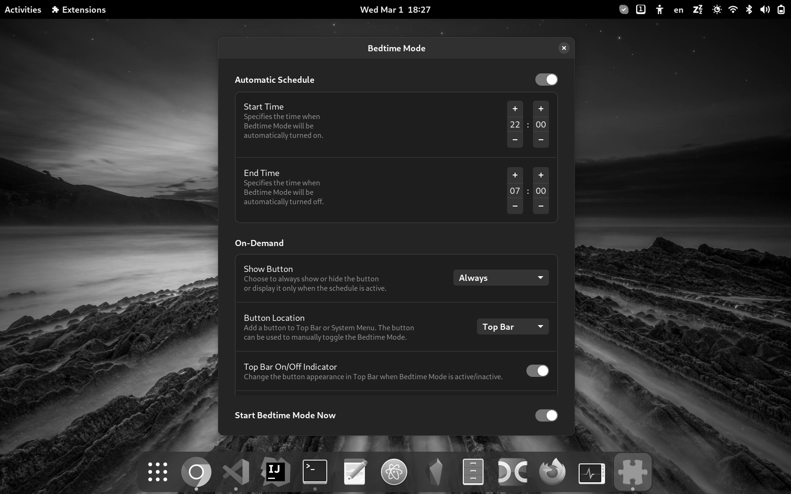

# Gnome Bedtime Mode 

Hey Gnome, it's bedtime!

Converts to grayscale the entire Gnome workspace by using a smooth transition. Best to use during evening/night.

This behaviour is similar to Android's bedtime mode which converts the phone screen to grayscale. It should somewhat make your device less appealing and limit the usage of it before bedtime. On my side, at least, it still requires a fair amount of self control in order to make that happen.

The extension has a nice Preferences (Settings) UI where you can customize it to your liking:

- Set an automatic schedule for turning on/off the Bedtime Mode
- Add an On Demand button to Top Bar or System Menu to manually toggle the mode
- Control the On Demand button visibility, appearance and position in Top Bar
- Choose another color preset and intensity, if you prefer a different color scheme
- Change color intensity by scrolling over the On Demand button in Top Bar when Bedtime Mode is active

Multi language support is also available. Please check the [Translators hall of fame](#translators) section for the supported languages list and [Guide for translators](#guide-for-translators) section if you want to contribute with a translation for your native language.

Peace! :sun_with_face:



# Installation

From the official GNOME Shell Extensions website:

[ego]: https://extensions.gnome.org/extension/4012/bedtime-mode/

[][ego]

Or

[latest]: https://github.com/ionutbortis/gnome-bedtime-mode/releases/download/v6.0/gnome-bedtime-mode_6.0.zip

You can download the [latest release package][latest] and manually install it to your extensions folder. Supported Gnome versions are 3.36, 3.38, 40 and 41!

```
wget https://github.com/ionutbortis/gnome-bedtime-mode/releases/download/v6.0/gnome-bedtime-mode_6.0.zip
# (Or manually download via browser and run the next commands from the download folder)

gnome-extensions install --force gnome-bedtime-mode_6.0.zip

rm gnome-bedtime-mode_6.0.zip
```

Next:

- On Gnome 3.36 and 3.38 press `Alt`+`F2`, type `r` in the dialog window and press `Enter`
- On Gnome 40+ you need to log out and log in again into your user account

You can now enable/disable the extension by running the Extensions app (search and install it from your distro repos or get it from [here](https://flathub.org/apps/details/org.gnome.Extensions)), or by
browsing to https://extensions.gnome.org/local.

Alternatively, you can do this from command line:

```
gnome-extensions enable gnomebedtime@ionutbortis.gmail.com
gnome-extensions disable gnomebedtime@ionutbortis.gmail.com
```

To open the extension's Preferences (Settings) UI, use the Extensions app or run this command:

```
gnome-extensions prefs gnomebedtime@ionutbortis.gmail.com
```

# Keyboard shortcut

If you want to use a keyboard shortcut in order to toggle the Bedtime Mode then you can do this:

- Go to Settings -> Keyboard Shortcuts
- Scroll to the end and press the "+" button
- Fill the inputs with the following
  - Name: Toggle Bedtime Mode
  - Command:

```
bash -c 'schema_id=org.gnome.shell.extensions.bedtime-mode; schema_dir=~/.local/share/gnome-shell/extensions/gnomebedtime@ionutbortis.gmail.com/schemas/; if [[ $(gsettings --schemadir $schema_dir get $schema_id bedtime-mode-active) == "true" ]]; then turn_on=false; else turn_on=true; fi; gsettings --schemadir $schema_dir set $schema_id bedtime-mode-active $turn_on;'
```

- Press Set Shortcut and use your preffered one
- Done!

# How can you contribute?

Help is always needed so if you found this extension helpful, the best way to contribute is to help with the creation of new translations (see next section).

If you encounter some bugs, please submit them as issues here on github. Also, feature requests or improvement ideas are welcomed.

# Guide for translators

If you like the extension and want to help in creating a translation for your native language, please carry on reading. :thumbsup:

Fork this github repository and clone your fork onto your local machine. Also, checkout the `next-release` branch:

```
git clone git@github.com:[your_github_username]/gnome-bedtime-mode.git
cd gnome-bedtime-mode/ && git checkout next-release
```

Run the `languages.sh` script with the `--new-locale=xx` argument in order to create a new translation file (you need to replace `xx` with your language code):

```
./scripts/languages.sh --new-locale=xx
```

Enter your email address when prompted and a new translation file should be succesfully generated into the `gnome-bedtime-mode/po` folder. It will have the name of the new locale and the `.po` extension.

Then, you just need to use a tool for opening the .po file and translate the texts. Popular choices are [ Gtranslator](https://flathub.org/apps/details/org.gnome.Gtranslator) and [POEdit](https://flathub.org/apps/details/net.poedit.Poedit).

When the new .po file is fully translated run the install script and the extension should be packaged with the new translations and installed to your Gnome shell.

Please **be aware** that the script is also trying to restart the Gnome shell and if you are on Wayland (Gnome 40+) all your opened windows will be closed! So first, you might want to save your work before running the install script:

```
./scripts/install.sh
```

If the new translations look fine push the changes and create a pull request to the `next-release` branch on the original repository.

That's it! You are now an official contributor to this extension, YaaY! :partying_face: :tada: :pray:

<a name="translators">

# Translators hall of fame :trophy:

- Spanish: [Óscar Fernández Díaz](https://github.com/oscfdezdz) :medal_sports:
- Dutch: [Heimen Stoffels](https://github.com/Vistaus) :medal_sports:
- German: [Philipp Kiemle](https://github.com/daPhipz) :medal_sports:
- Romanian & English: [Ionuț Florin Bortiș](https://github.com/ionutbortis) (myself) :medal_sports:

# Credits

Credits for inspiration go to:

- [Desaturate All](https://extensions.gnome.org/extension/1102/desaturate-all/) extension | [Github URL](https://github.com/laerne/desaturate_all)
- [Tint All](https://extensions.gnome.org/extension/1471/tint-all/) extension | [Github URL](https://github.com/amarovita/tint-all)
- [Night Theme Switcher](https://extensions.gnome.org/extension/2236/night-theme-switcher/) extension | [Gitlab URL](https://gitlab.com/rmnvgr/nightthemeswitcher-gnome-shell-extension/)

I wrote this extension because I use the Android's Bedtime Mode on a daily basis and I wanted something similar for my laptop. Having Ubuntu as my main OS, I liked the idea of extending the desktop shell to your liking. It was also a good way to improve on my JavaScript coding skills.

Many thanks to the creator of the [Night Theme Switcher](https://gitlab.com/rmnvgr/nightthemeswitcher-gnome-shell-extension/) extension. I used his code for reference since the Gnome Extensions Coding documentation was not that great when I first started.
